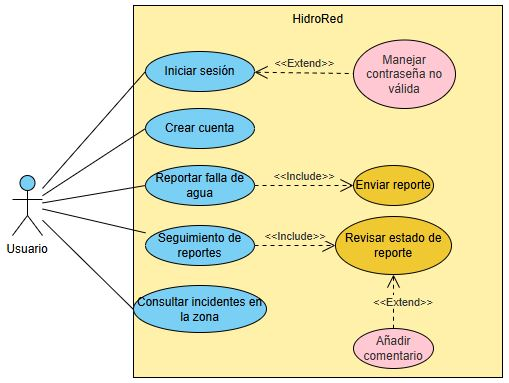
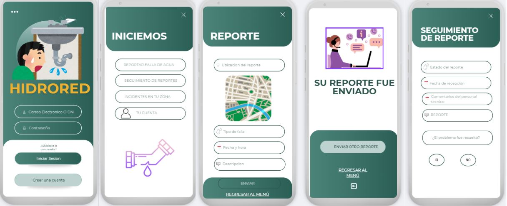
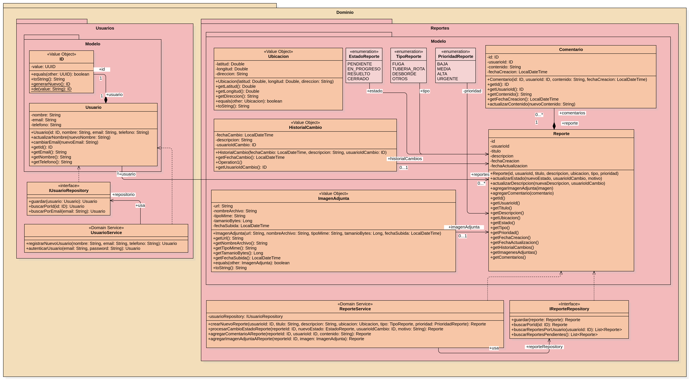
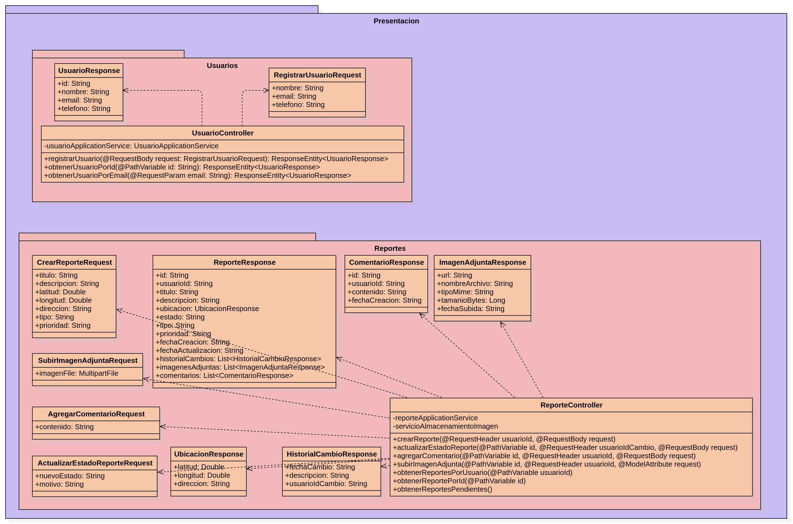
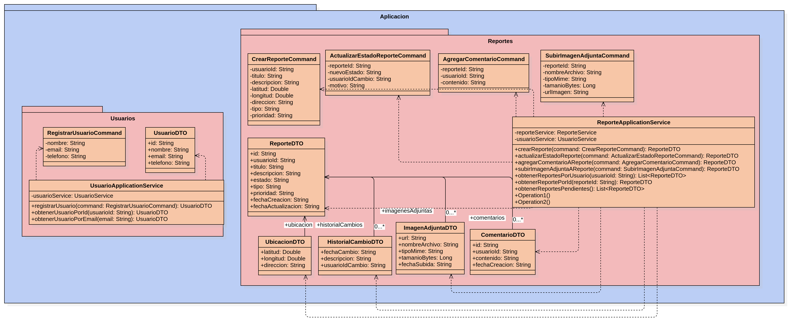
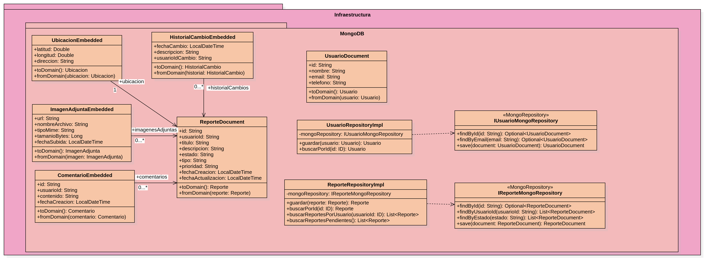
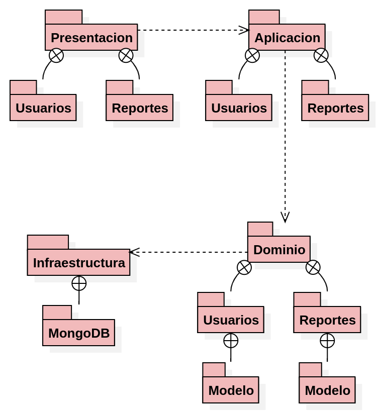
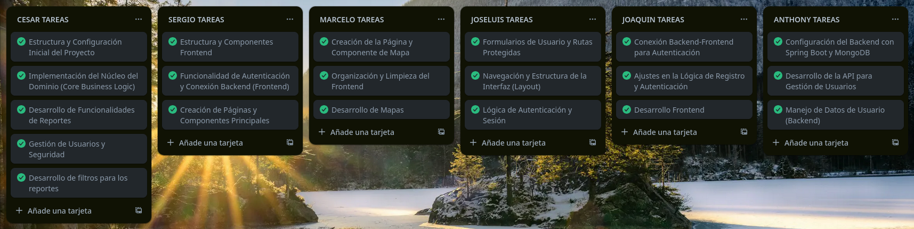

---
# Hidrored

### Integrantes

- Condorios Chambi, Anthony Richar
- Castelo Choque, Joaquin Andree
- Hanari Cutipa, Cesar Alejandro
- Calcina Muchica, Sergio Eliseo
- Calizaya Quispe, Jose Luis
- Quina Delgado, Marcelo Adrian

---

# **Índice**
- [Tecnologías Utilizadas](#tecnologias)
- [Cómo Empezar](#como-empezar)
    - [Prerrequisitos](#prerrequisitos)
    - [Configuración del Backend (Spring Boot)](#setup-backend)
    * [Configuración del Frontend (React)](#setup-frontend)
- [Proposito](#proposito)
- [Funcionalidades](#funcionalidades)
    - [Diagramas de Caso de Uso](#diagramas-de-caso-de-uso)
    - [Prototipo](#prototipo)
- [Modelo de dominio](#modelo-dominio)
- [Visión General de Arquitectura](#vision-arquitectura)
    - [Capa Presentacion](#capa-presentacion)
    - [Capa Aplicacion](#capa-aplicacion)
    - [Capa Dominio](#capa-dominio)
    - [Capa Infraestructura](#capa-infraestructura)
    - [Diagrama de Paquetes](#diagrama-paquetes)
- [Análisis de Arquitectura y Calidad de Código](#analisis-arquitectura)
    - [Estilos de Programación](#estilos-programacion)
        - [1. Things (Programación Orientada a Objetos)](#estilo-things)
        - [2. Error/Exception Handling](#estilo-handling)
        - [3. Cookbook](#estilo-cookbook)
    - [Convenciones de Codificación](#convenciones-codificacion)
    - [Principios SOLID](#principios-solid)
        - [1. Principio de Responsabilidad Única (SRP)](#solid-srp)
        - [2. Principio de Abierto/Cerrado (OCP)](#solid-ocp)
        - [3. Principio de Sustitución de Liskov (LSP)](#solid-lsp)
        - [4. Principio de Segregación de Interfaces (ISP)](#solid-isp)
        - [5. Principio de Inversión de Dependencias (DIP)](#solid-dip)
    - [Clean Code](#clean-code)
        - [1. Nombres Significativos](#clean-nombres)
        - [2. Funciones Pequeñas](#clean-funciones)
        - [3. Reemplazar "Números Mágicos"](#clean-numeros-magicos)
        - [4. DRY - No te repitas](#clean-dry)
        - [5. Estructura de Código Fuente](#clean-estructura)
        - [6. Tratamiento de Errores](#clean-errores)
        - [7. Evitar Argumentos de Bandera](#clean-flags)
        - [8. Declarar Variables Cerca de su Uso](#clean-variables)
    - [Domain-Driven Design (DDD) y Clean Architecture](#ddds)
        - [Entidades y Objetos de Valor](#ddd-entidades)
        - [Agregados y Módulos](#ddd-agregados)
        - [Fábricas](#ddd-fabricas)
        - [Repositorios](#ddd-repositorios)
        - [Arquitectura en Capas](#ddd-capas)

---
<div id="tecnologias"></div>

## **Tecnologías Utilizadas**

| Área          | Tecnología          | Propósito                                                  |
| :------------ | :------------------ | :--------------------------------------------------------- |
| **Backend** | Java 17             | Lenguaje de programación principal.                        |
|               | Spring Boot 3       | Framework para la creación de la API REST.                 |
|               | Spring Data MongoDB | Para la interacción con la base de datos MongoDB.          |
|               | Spring Security     | Para la gestión de seguridad y autenticación.              |
|               | Lombok              | Para reducir el código repetitivo en las clases de Java.   |
|               | Maven               | Gestor de dependencias y construcción del proyecto.        |
| **Frontend** | React 18            | Biblioteca para la construcción de la interfaz de usuario. |
|               | TypeScript          | Lenguaje de programación para el frontend.                 |
|               | Vite                | Herramienta de construcción y servidor de desarrollo.      |
|               | Tailwind CSS        | Framework de CSS para el diseño de la interfaz.            |
|               | Leaflet             | Biblioteca para la creación de mapas interactivos.         |
|               | Axios               | Cliente HTTP para la comunicación con el backend.          |
| **Base de Datos**| MongoDB             | Base de datos NoSQL orientada a documentos.                |
| **Herramientas**| Git / GitHub        | Sistema de control de versiones.                           |
|               | SonarQube           | Para el análisis estático de la calidad del código.        |

---
<div id="como-empezar"></div>

## **Cómo Empezar**

Sigue estas instrucciones para configurar y ejecutar el proyecto en tu entorno local.

<div id="prerrequisitos"></div>

### **Prerrequisitos**

* **Java JDK 17** o superior.
* **Maven 3.8** o superior.
* **Node.js 18** o superior.
* **MongoDB** instalado y corriendo en el puerto por defecto (27017).

<div id="setup-backend"></div>

### **Configuración del Backend (Spring Boot)**

1.  **Clona el repositorio y navega a la carpeta del backend:**
    ```bash
    git clone <URL_DEL_REPOSITORIO>
    cd Hidrored/backend
    ```
2.  **Compila y ejecuta la aplicación:**
    ```bash
    mvn spring-boot:run
    ```
    El backend estará corriendo en `http://localhost:8080`.

<div id="setup-frontend"></div>

### **Configuración del Frontend (React)**

1.  **Navega a la carpeta del frontend:**
    ```bash
    cd ../frontend 
    ```
2.  **Instala las dependencias y ejecuta el servidor de desarrollo:**
    ```bash
    npm install
    npm run dev
    ```
    La aplicación frontend estará disponible en `http://localhost:5173`.

---
<div id="proposito"></div>

# Proposito

**Hidrored** busca facilitar la comunicación entre los ciudadanos y las entidades responsables de los servicios de agua y desagüe, permitiendo un reporte ágil y un seguimiento transparente de las incidencias.

### Propósito Principal:
* **Centralización de Reportes:** Proporcionar un canal único y accesible para que los usuarios puedan informar sobre problemas de agua y desagüe de manera eficiente.
* **Transparencia y Seguimiento:** Ofrecer a los usuarios la capacidad de rastrear el estado de sus reportes en tiempo real y recibir actualizaciones.
* **Mejora de la Gestión:** Ayudar a las autoridades o empresas de servicios a recibir información detallada y localizada de los problemas, facilitando una respuesta más rápida y efectiva.

---
<div id="funcionalidades"></div>

# Funcionalidades

<div id="diagramas-de-caso-de-uso"></div>

## **Diagramas de Caso de Uso**
El **diagrama de casos de uso** representa las principales interacciones entre el **Usuario** y el sistema **HidroRed**.  
- Permite visualizar las funcionalidades clave y cómo el usuario accede a ellas.  
- Incluye relaciones **`<<include>>`** para funcionalidades obligatorias y **`<<extend>>`** para escenarios opcionales.  

**Diagrama:** 



**Principales casos de uso:** - Iniciar sesión / Crear cuenta  
- Reportar fallas de agua (**incluye**: Enviar reporte)  
- Seguimiento de reportes (**incluye**: Revisar estado de reporte, **extiende**: Añadir comentario)  
- Consultar incidentes en la zona  
- Manejo de errores de autenticación (**extiende**: Manejar contraseña no válida)

<div id="prototipo"></div>

## **Prototipo**
El **prototipo** ofrece una visualización preliminar de la interfaz de usuario de **HidroRed**.  
- Muestra el flujo principal de navegación del sistema.  
- Facilita la validación de la experiencia de usuario antes del desarrollo completo.  

**Prototipo:** 



---

<div id="modelo-dominio"></div>

# Modelo de dominio



---

<div id="vision-arquitectura"></div>

# Visión General de Arquitectura

<div id="capa-presentacion"></div>

### Capa Presentacion



<div id="capa-aplicacion"></div>

### Capa Aplicacion



<div id="capa-dominio"></div>

### Capa Dominio


<div id="capa-infraestructura"></div>

### Capa Infraestructura



<div id="diagrama-paquetes"></div>

### Diagrama de Paquetes



---

<div id="analisis-arquitectura"></div>

# Análisis de Arquitectura y Calidad de Código

<div id="estilos-programacion"></div>

## **Estilos de Programacion**

<div id="estilo-things"></div>

### **1. Things (Programación Orientada a Objetos)**

Se aplicó el estilo orientado a objetos, donde se modelan las “cosas” del sistema como objetos del mundo real. Cada clase representa una entidad, acción o transporte de información, con una responsabilidad única y bien definida.
Este estilo nos da diferentes beneficios como separación de responsabilidades, código más legible y mantenible y facilidad para aplicar pruebas y reusar la lógica.

Este estilo nos brinda beneficios como:

- Separación de responsabilidades
- Código más legible y mantenible
- Facilidad para aplicar pruebas unitarias
- Reutilización de la lógica de negocio

    * **Evidencia (`Usuario.java`):**
        ```java
        @Document(collection = "usuarios")
        @Getter
        public class Usuario {
            @Id
            private String id;
            private String nombre;
            @Indexed(unique = true)
            private String email;
            private String telefono;
            private String password;
        }
        ```

- Se crea una instancia de la entidad de dominio `Usuario` con sus principales atributos.
- Es una “cosa” central del dominio modelada como objeto.

<div id="estilo-handling"></div>

### **2. Error/Exception Handling**

Es una técnica que permite manejar validaciones y errores mediante excepciones controladas en los servicios de aplicación.

En lugar de verificar condiciones con if por todas partes se lanza una excepcion cuando algo falla.

* **Evidencia (`FileStorageService.java`):**
    ```java
    public ImagenAdjunta store(MultipartFile file) {
        if (file.isEmpty()) {
            // Lanza una excepción específica, no una genérica.
            throw new StorageException("No se puede guardar un archivo vacío.");
        }
        try {
            Files.copy(file.getInputStream(), this.rootLocation.resolve(uniqueFilename));
        } catch (IOException e) {
            // Envuelve la excepción de bajo nivel con una de dominio.
            throw new StorageException("Fallo al guardar el archivo.", e);
       }
    }
    ```


<div id="estilo-cookbook"></div>

### **3. Cookbook**

El estilo Cookbook (libro de recetas) se refiere a una forma de programar en la que:

- Se siguen soluciones ya conocidas, probadas y reutilizables.
- Se aplica una “receta” para resolver un problema específico.
- Normalmente se basa en ejemplos y buenas prácticas, sin mucha personalización.
- Es muy común en frameworks como Spring, donde gran parte del trabajo ya está estructurado.

* **Evidencia (`Usuario.java`):**
    ```java
    @Document(collection = "usuarios")
    @Getter
    public class Usuario {
        @Id
        private ID id;
        private String nombre;
        @Indexed(unique = true)
        private String email;
        private String telefono;
    }
    ```

Spring se aplica al facilitar la creación de APIs RESTful y la conexión con MongoDB mediante anotaciones como `@Document` y `@Id`, que indican que la clase se representa un documento en una colección de la base de datos. 

Por otro lado, Lombok simplifica tu código al generar automáticamente los métodos get para los atributos del DTO (`UsuarioDTO`) con la anotación `@Getter`, evitando que tengas que escribirlos manualmente. Así, ambos frameworks trabajan juntos para que tu código sea más limpio, legible y fácil de mantener.

<div id="convenciones-codificacion"></div>


### **Convenciones de Codificación**

Se siguen las convenciones estándar de Java para asegurar la legibilidad y consistencia del código.

| Aspecto                           | Descripción                                                                 |
|-----------------------------------|-----------------------------------------------------------------------------|
| **Nombres de clases** | Uso de PascalCase en `Usuario` y `UsuarioDTO`.                             |
| **Nombres de variables y métodos**| Uso de camelCase (`getNombre()`, `telefono`, `desdeDominio()`).           |
| **Comentarios JavaDoc** | Documentación clara de clases, métodos y constructores.                    |
| **Estructura del código** | Código limpio, indentación coherente y separación clara entre bloques.    |
| **Uso de anotaciones** | Se aplican correctamente anotaciones de frameworks como Spring y Lombok: <br> `@Getter`, `@Document`, `@Id`, `@Indexed`. |
| **Encapsulamiento** | Atributos privados con acceso mediante getters públicos.                   |
| **Constructores controlados** | Constructor privado en `UsuarioDTO` y uso de método factory `desdeDominio()`. |
| **Organización de paquetes** | Separación por capas (`dominio`, `aplicacion`), aunque se sugiere normalizar la capitalización (`Usuarios` → `usuarios`). |
| **Comparación de objetos** | Implementación de `equals()` y `hashCode()` basada en el identificador (`id`). |

---
<div id="principios-solid"></div>

## **Principios SOLID**

<div id="solid-srp"></div>

### **1. Principio de Responsabilidad Única (SRP)**

> "Una clase solo debe tener una responsabilidad”.

El objetivo es separar comportamientos para que los cambios en uno no afecten a otros.

- **`ReporteController.java`**: Su única responsabilidad es gestionar las peticiones web. No contiene lógica de negocio ni accede directamente a la base de datos.
  ```java
  @RestController
  @RequestMapping("/api/reportes")
  public class ReporteController {
      private final ReporteApplicationService reporteService;
      // ...
  }
  ```

- **`ReporteFabrica.java`**: Su única responsabilidad es construir instancias de la clase `Reporte`. Si la lógica de creación cambia, solo se modifica esta clase.
  ```java
  public class ReporteFabrica {
      public Reporte crearReporte(DatosReporte datos, ...) {
          // ... lógica de creación
      }
  }
  ```
- `ServicioUsuario.java` se encarga **solo de coordinar lógica de negocio** relacionada a usuarios.
- `UsuarioDTO.java` se dedica **exclusivamente a transferir datos**.

<div id="solid-ocp"></div>

### **2. Principio de Abierto/Cerrado (OCP)**

> "Las clases deben estar abiertas para la extensión, pero cerradas para la modificación."

Se utilizan interfaces para permitir la extensión sin alterar el código existente. `IReporteRepositorio` actúa como un contrato que puede tener múltiples implementaciones (ej. para MongoDB, SQL, etc.) sin cambiar el código que la utiliza.

* **Evidencia:** La interfaz `IReporteRepositoryCustom` está cerrada a la modificación, pero podemos añadir nuevas implementaciones (ej. para otra base de datos) sin cambiar el código que la usa.
    ```java
    // IReporteRepositoryImpl.java en la capa de infraestructura
    // Implementa la interfaz sin modificarla.
    public class IReporteRepositoryImpl implements IReporteRepositoryCustom { 
        private final MongoTemplate mongoTemplate;
       // ...
    }
    ```

<div id="solid-lsp"></div>

### **3. Principio de Sustitución de Liskov (LSP)**

> "Si la clase A es un subtipo de la clase B, deberíamos poder reemplazar B por A sin afectar el comportamiento del programa."

`ServicioUsuario` depende de **interfaces como `IUsuarioRepository` y `PasswordEncoder`**, no de implementaciones concretas. Esto permite cambiar la implementación sin alterar la lógica de negocio.

<div id="solid-isp"></div>

### **4. Principio de Segregación de Interfaces (ISP)**

> "Los clientes no deben verse obligados a depender de métodos que no utilizan."

En lugar de una única interfaz `IRepositorioGlobal`, el proyecto utiliza interfaces específicas y cohesivas para cada dominio como `IUsuarioRepositorio` y `IHistorialRepositorio`.

<div id="solid-dip"></div>

### **5. Principio de Inversión de Dependencias (DIP)**

> "Los módulos de alto nivel no deben depender de los de bajo nivel; ambos deben depender de abstracciones (Interfaces)."

Las clases de servicio (alto nivel) dependen de interfaces de repositorio (abstracciones), no de sus implementaciones concretas. La implementación se "inyecta", desacoplando el código.

```java
// El servicio depende de la abstracción IReporteRepositorio
public class ReporteServicioImpl extends IReporteServicio {
    private final IReporteRepositorio reporteRepositorio;

    public ReporteServicioImpl(IReporteRepositorio reporteRepositorio) {
        this.reporteRepositorio = reporteRepositorio;
    }
}
```

---
<div id="clean-code"></div>

## **Clean Code**

El proyecto sigue prácticas de código limpio para mejorar la legibilidad y el mantenimiento.

<div id="clean-nombres"></div>

### **1. Nombres Significativos y que Revelan la Intención**

Se utilizan nombres descriptivos que hacen el código auto-explicativo. El método `registrarUsuario` y sus parámetros son un claro ejemplo.

<div id="clean-funciones"></div>

### **2. Funciones Pequeñas y con una Sola Responsabilidad**

Cada función tiene un propósito único y bien definido, lo que facilita su comprensión y prueba.

<div id="clean-numeros-magicos"></div>

### **3. Reemplazar "Números Mágicos" con Constantes o Enums**

Se utilizan `enums` para evitar valores "hardcodeados", mejorando la legibilidad y centralizando la gestión de valores permitidos.

```java
public enum TipoReporte {
    Fuga,
    TuberiaRota,
    Desague,
    Otro;
}
```

<div id="clean-dry"></div>

### **4. DRY - No te repitas (Don't Repeat Yourself)**

Se evita la duplicación de código centralizando la lógica en un solo lugar. La `ReporteFabrica` asegura que todos los reportes se creen de manera consistente.

<div id="clean-estructura"></div>

### **5. Estructura de Código Fuente (Formato Vertical)**

El código se organiza de manera lógica y vertical, agrupando elementos relacionados para facilitar la lectura, como en la clase `Reporte`.

<div id="clean-errores"></div>

### **6. Tratamiento de Errores: Proporcionar Contexto en las Excepciones**

El constructor `StorageException(String message, Throwable cause)` permite capturar una excepción de bajo nivel (como una `IOException`) y envolverla en una excepción de más alto nivel con un mensaje descriptivo, dando contexto al error.

<div id="clean-flags"></div>

### **7. Funciones: Evitar Argumentos de Bandera (Flag Arguments)**

En lugar de un solo método como `obtenerReportes(boolean soloActivos)`, se han creado métodos distintos y descriptivos como `obtenerReportesCercanos` y `obtenerReportesPorUsuario`.

<div id="clean-variables"></div>

### **8. Estructura del Código: Declarar Variables Cerca de su Uso**

La variable `command` se declara justo antes de ser utilizada. Esto mejora la legibilidad al mantener la definición y el uso de la variable en el mismo contexto.

```java
// En presentacion/reportes/ReporteController.java
@PostMapping
public ResponseEntity<ReporteDTO> crearReporte(...) {
    // La variable 'command' se declara y usa inmediatamente después.
    CrearReporteCommand command = new CrearReporteCommand(...);
    ReporteDTO nuevoReporte = reporteService.crearReporte(command);
    return ResponseEntity.ok(nuevoReporte);
}
```


<div id="ddds"></div>

### **Domain-Driven Design (DDD) y Clean Architecture**

<div id="ddd-entidades"></div>

* **Entidades y Objetos de Valor**
    * **Descripción:** Las **Entidades** son objetos con una identidad única que persiste en el tiempo, como `Reporte` y `Usuario`. Los **Objetos de Valor** son objetos inmutables definidos por sus atributos, como `ImagenAdjunta` o `Comentario`.
    * **Evidencia (`Reporte.java`):**
        ```java
        @Document(collection = "reportes")
        public class Reporte {
            @Id
            private String id; // Identidad única de la entidad
            // ...
            private ImagenAdjunta imagenAdjunta; // Contiene un Objeto de Valor
            private List<Comentario> comentarios; // Contiene una lista de Objetos de Valor
        }
        ```

<div id="ddd-agregados"></div>

* **Agregados y Módulos**
    * **Descripción:** Un **Agregado** es un grupo de objetos de dominio que se tratan como una sola unidad. `Reporte` es la Raíz del Agregado, controlando el acceso a `Comentario` e `HistorialCambio`. Los **Módulos** son los paquetes de Java (`dominio.reportes`, `dominio.usuarios`) que agrupan conceptos relacionados.
    * **Evidencia (`Reporte.java`):**
        ```java
        public class Reporte {
            // ...
            private List<Comentario> comentarios = new ArrayList<>();

            // La Raíz del Agregado es la única que puede modificar sus partes internas.
            public void agregarComentario(String usuarioId, String contenido) {
                this.comentarios.add(new Comentario(usuarioId, contenido));
                this.fechaActualizacion = LocalDateTime.now();
            }
        }
        ```

<div id="ddd-fabricas"></div>

* **Fábricas**
    * **Descripción:** Las fábricas se encargan de la creación de objetos complejos, asegurando que se creen en un estado válido. En este proyecto, los constructores de las entidades actúan como fábricas simples, conteniendo la lógica de validación inicial.
    * **Evidencia (`ImagenAdjunta.java`):**
        ```java
        public ImagenAdjunta(String url, String nombreArchivo, String tipoMime, Long tamanioBytes, LocalDateTime fechaSubida) {
            // Lógica de validación para asegurar un estado consistente
            if (url == null || tamanioBytes <= 0) {
              throw new IllegalArgumentException("Los campos de ImagenAdjunta son obligatorios y válidos.");
            }
            this.url = url;
            // ...
        }
        ```

<div id="ddd-repositorios"></div>

* **Repositorios**
    * **Descripción:** Los repositorios son interfaces definidas en la capa de Dominio que abstraen la lógica de persistencia. El dominio define el "qué" (ej. `IReporteRepository`) y la infraestructura implementa el "cómo".
    * **Evidencia (`IReporteRepository.java`):**
        ```java
        package com.hidrored.dominio.Reportes;
        
        // Interfaz pura en la capa de dominio, sin dependencias de MongoDB.
        public interface IReporteRepository extends MongoRepository<Reporte, String>, IReporteRepositoryCustom {
            List<Reporte> findByUsuarioId(String usuarioId);
            List<Reporte> findByDistritoIgnoreCase(String distrito);
        }
        ```

<div id="ddd-capas"></div>

* **Arquitectura en Capas**
    * **Descripción:** El proyecto está estructurado en cuatro capas distintas (Presentación, Aplicación, Dominio, Infraestructura). Las dependencias siempre apuntan hacia adentro (hacia el Dominio), lo que desacopla la lógica de negocio de los detalles técnicos como la base de datos o la API REST.
    * **Evidencia (Flujo de una petición):**
        1.  `ReporteController` (Presentación) recibe una petición HTTP.
        2.  Llama a `ReporteApplicationService` (Aplicación) con un `Command`.
        3.  El servicio usa `IReporteRepository` (Dominio) para orquestar la lógica.
        4.  La implementación del repositorio en `IReporteRepositoryImpl` (Infraestructura) ejecuta la consulta en MongoDB.

# Gestión de proyecto

## Trello

* **URL:** [Trello](https://trello.com/b/LHojjtUQ/aguais)

* **Tablero**


